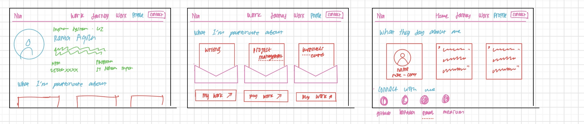
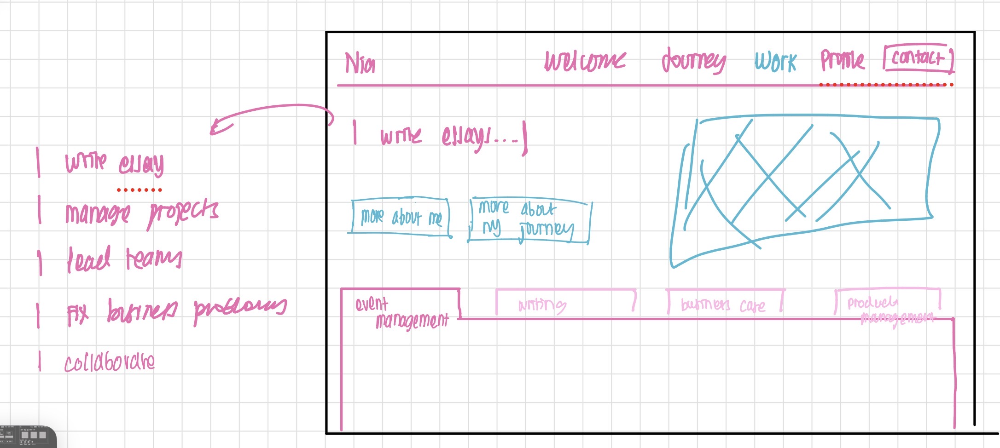

Nama : Rania Aqila

NPM : 2506623282

Kelas : PBP C

-------------------------------------

> ### TUGAS 01
## Refleksi

1. Ya, saya menggunakan dan menambahkan beberapa semantik HTML5, yang mana mencangkup
* *nav* : membuat navigation bar di kanan atas untuk nantinya direct ke 5 halaman berbeda (Home, Journey, Work, Profile, Contact)
* *h2* : membuat text section title berupa "What I'm Passionate About" "What They Say About Me" "Connect With Me" agar by default tidak sebesar title nama, namun cukup untuk dihighlight karena secara hirearki di bawah
* *section* : memisahkan antar section, di page about me ini antara "What I'm Passionate About" "What They Say About Me", dan "Connect With Me"
* *img* : mencantumkan foto pribadi & logo media sosial
* *svg* : membuat bunga di belakang foto dan icon custom (Github, LinkedIn, Email, Medium) pada section "Connect With Me" dalam bentuk vector sehingga warnanya bisa mengikuti tema saat di-hover, tanpa perlu load file gambar eksternal
* *div* : container untuk membungkus beberapa komponen menjadi satu
* *span* : membungkus bagian teks kecil di dalam elemen lain yang sifatnya inline
* *article* : membungkus konten yang sifatnya berdiri sendiri dan berulang, seperti tiap card "passion" (Writing, Project Management, Business Cases) dan tiap card testimoni
* *header* dan *footer* : masing-masing untuk bagian navbar di paling atas dan bagian copyright di paling bawah halaman

    Seluruh elemen semantik yang digunakan diatas telah cukup untuk membuat struktur halaman About Me dalam website saya, sehingga beberapa elemen lainnya tidak diperlukan seperti *aside* yang mana memiliki fungsi utama yang sama dengan *div*

2. Saya menggunakan tata letak baru berupa grid pada section "What They Say About Me" dimana terdapat perubahan dari menggunakan 3 box menjadi 2 box, awalnya saya terdapat kesulitan dalam mengatur ulang kembali width & height dari kedua box agar sesuai dengan space yang ada dimana di awal text testimoni yang saya masukkan juga overflow/melewati batas box sehingga saya meng-adjust kembali font sizenya. Untuk perubahan font size saya pun memutuskan menggunakan satuan px instead of rem (yang awal digunakan di template) sebagaimana dengan satuan yang lebih besar perubahan dapat lebih mendetail. Elemen yang harus diubah posisinya tentunya bagian utamanya seperti envelope atau kotak testimoni sehingga isi di dalamnya mengikutinya saja. 

3. Karena website masih static, maka setiap kali ada pembaruan data saya perlu untuk mengubahnya satu persatu di file index.html saya. Dengan keterbatasan ini, untuk iterasi proyek selanjutnya, fungsionalitas dinamis yang paling ingin saya siapkan adalah mengubah data pada testimoni menjadi berbasis model/database sehingga bisa diubah melalui form atau halaman admin, tanpa perlu mengedit HTML setiap kali ada perubahan, lalu bisa juga integrasikan sistem emailing instead of direct link mailto aja menjadi ada section dimana mereka bisa mengirimkan email langsung. 

## AI Declaration

Saya menggunakan gen AI berupa Claude dengan tetap mengerjakan bagian besar dari projek ini dan memanfaatkan AI secara ethical, yakni:
1. Mencari referensi awal: Sebelum memulai memodifikasi template, saya mencari tahu berbagai bentuk web porto melalui situs https://www.awwwards.com/websites/portfolio/ untuk mencari tahu apa saya komponen umum yang ada pada website portofolio dan mencari tahu style design yang sesuai dengan yang saya sukai, saya pun juga membaca dokumentasi HTML & CSS pada https://www.w3schools.com/html/default.asp dan https://www.w3schools.com/css/default.asp untuk mencari tahu komponen-komponen HTML & CSS dan masing-masing kegunaannya
2. Membenarkan Color Palette: Sejak awal saya menggunakan CP dengan nuansa pink yang saya dapati dari https://coolors.co/palettes/trending namun, saya merasa warna yang saya gunakan dan integrasinya dalam website saya masih kurang pas sehingga saya meminta AI dengan prompt "recommend color palettenya gimana yang sesuai gabungin vibe web pleurat itu sm color palette yg udah di pake sekarang" sebagaimana website portofolio https://www.pleurat.com/ yang saya temukan melalui https://www.awwwards.com/websites/portfolio/ menjadi referensi utama saya dalam style design website portofolio saya, digabungkan dengan beberapa referensi yang saya jabarkan lainnya.
3. Membuat Design Wireframe: Saya mengerjakan wireframe saya 100% sendiri sebagaimana sketch yang dapat dilihat melalui(), wireframe ini menjadi baseline awal saya dalam memodifikasi dan menambahkan ulang code html & css saya
4. Membuat envelope di section What I'm Passionate About: Saya menemukan website uiwomeninbusiness.com dan menggunakan section bagian core value sebagai referensi saya, awalnya saya mencoba membuat sendiri bagian kotak dan segitiga dari envelope, namun positioningnya menjadi berantakan sehingga saya meminta AI dengan prompt "bagaimana cara membenarkan envelope ini agar bisa kegabung dan membuka keatas"
5. Membuat kotak di section What They Say About Me: Setelah awal digenerate oleh AI, terdapat kekurangan berupa sizing kotak yang tidak sesuai dimana foto pemberi testimoni bentuknya juga kotak, kotak tulisannya yang satu ukurannya terlalu besar sedangkan yang lainyya terlalu kecil sehingga tidak konsisten, saya pun mengubah sendiri di bagian .testimonial-card di style.css dengan menetapkan height: 600px; dan width: 400px; lalu saya pun juga mengadjust ulang font testimonial menjadi 10px;
6. Penggunaan AI lainnya dilakukan untuk bug fixes ketika dibutuhkan, kerangka utama dari website tetap dibuat sendiri

-------------------------------------

> ### TUGAS 02
## Refleksi

1. Sebagaimana yang didapati dari PPT "MTV Django Architecture" dari Scele, proses ini bermula dengan browser yang mengirimkan request ke server dengan command python manage.py runserver -> Django cek urls.py projek -> diteruskan ke urls.py aplikasi (yang ada di main) buat diarahin ke path yang sesuai dimana nyambung ke Views (e.g. di urls path("works/", show_works, name="show_works") -> extract arguments dari request -> diarahin ke function show_works yang ada di views.py) -> view membaca data dari model -> berkomunikasi langsung ke database (DB) -> data yang udah diambil view dimasukkan ke context -> dikirim ke template -> tempolate menggabungkan file HTML statis dengan data dari view -> HTML hasil merge dikirim balik sebagai HTTP Response ke browser lewat internet -> browser ngerender jadi halaman yang bisa dilihat user
* urls.py proyek: meneruskan request ke urls.py aplikasi yang sesuai
* urls.py aplikasi: mencocokkan path ke function view yang tepat
* view: menerima request, mengambil data yang diperlukan dari model, meneruskannya ke template yang sesuai
* model: merepresentasikan struktur data, set of data yang disimpan untuk diproses di aplikasi 
* template: menggabungkan file HTML statis dengan data dari view
2. Apabila data ditulis langsung di dalam template hal ini akan menyusahkan perubahan di kedepannya karena user tidak bisa langsung mengubah tanpa mengakses melalui Django Admin lalu perlu deploy ulang aplikasi terus-menerus. Hal tersebut pun akan menyusahkan pemeliharaan dan pengembangan aplikasi, sebagaimana kode kurang scalable. 
3. Contohnya adalah ketika membuat model "Work" baru dimana setelah membuat class Work di models.py dijalankan makemigrations yang mana menghasilkan file baru [main/migrations/0002_work.py] di folder migrations, kemudian di-migrate yaitu mengeksekusi instruksi yang ada di file migration tersebut ke database.
* makemigrations: membaca models.py, membandingkannya dengan riwayat migration yang sudah ada sebelumnya, membuat file migration baru
* migrate: mengeksekusi file migration yang ada

## AI Declaration
Saya menggunakan gen AI berupa Claude dengan tetap mengerjakan bagian besar dari projek ini dan memanfaatkan AI secara ethical, yakni:

1. Mencari referensi awal: Sebelum memulai memodifikasi template, saya mencari tahu berbagai bentuk web porto melalui situs [https://www.awwwards.com/websites/portfolio/] untuk mencari tahu apa saya komponen umum yang ada pada website portofolio dan mencari tahu style design yang sesuai dengan yang saya sukai, saya pun juga membaca dokumentasi HTML & CSS pada [https://www.w3schools.com/html/default.asp] dan [https://www.w3schools.com/css/default.asp] untuk mencari tahu komponen-komponen HTML & CSS dan masing-masing kegunaannya
2. Membuat Design Wireframe: Saya mengerjakan wireframe saya 100% sendiri sebagaimana sketch yang dapat dilihat melalui(), wireframe ini menjadi baseline awal saya dalam memodifikasi dan menambahkan ulang code html & css saya
3. Perubahan efek grid saat hover: Saya mencari referensi awal melalui https://www.awwwards.com/websites/portfolio/ dan menemukan [https://www.kaviengcreative.com/#archive] sebagai referensi untuk efek b&w -> color
4. Sebagian besar kerangka kode pada halaman "works" didapati dengan mengikuti kerangka "experience" dari tutor 02 dengan menyesuaikan kembali sejumlah komponennya sesuai wireframe yang saya rancang
5. Pembuatan folder dan efek typewriter didapati dari AI dengan modifikasi lebih lanjut dari saya untuk mengatur ukuran (karena awal hasil AI tag foldernya terlalu kecil), merancang isi tulisan sendiri, dan speed.
6. Penggunaan AI lainnya dilakukan untuk bug fixes ketika dibutuhkan, kerangka utama dari website tetap dibuat sendiri

-------------------------------------

> ### TUGAS 03
## Refleksi
1. Apabila membuat form secara manual, setiap kali ada perubahan atribut maka perlu mengubah template dan views.py secara manual juga yang mana kurang efisien. Dengan ModelForm, kita bisa mengambil struktur atribut dari model Django dan membuat representasi form berdasarkan atribut tersebut secara langsung. Sementara itu,  digunakan untuk melindungi form dari serangan Cross-Site Request Forgery (CSRF), yaitu ketika seseorang yang tidak seharusnya memiliki akses mencoba membuat browser pengguna mengirimkan request ke server Django. Dengan adanya token CSRF berupa token rahasia dan unik yang dibuat oleh server, Django dapat memverifikasi bahwa request yang dikirim berasal dari form yang sah. Apabila token tidak sesuai atau tidak ada, Django akan menolak request tersebut.
2. JSON memiliki format yang lebih ringkas dan sederhana dibandingkan XML dimana JSON menggunakan sistme key-value "key": "value" sedangkan XML menggunakan tag "<>". Selain itu, ketika diintegrasikan dengan JavaScript, JSON juga lebih mudah sebagaimana browser bisa melakukan parsing string JSON menjadi objek JavaScript langsung sedangkan XML memerlukan pembacaan struktur DOM Tree. 
3. Browser/postman mengirimkan HTTP GET Request ke URL endpoint API -> Django mencocokkan path URL di urls.py ->  mengeksekusi fungsi yang sesuai di views.py -> database query melalui Django ORM -> QuerySet yang berisi instansiasi objek Python diteruskan ke serializer -> objek tersebut diubah jadi format tesk JSON -> dikirimkan kembali ke client untuk dirender

## AI Declaration
1. Sebagian besar implementasi pada bagian form didapati dengan mengikuti kerangka HTML yang sudah ada dari tutor 03, sehingga saya melakukan refactor dan penyesuaian dari baseline tersebut untuk menyesuaikan kembali file experience.html, experience_form.html, dan experience_delete_modal dengan struktur website saya.
2. Untuk bagian pop-up, saya mencari referensi dan contoh implementasi sendiri melalui https://codemyui.com/tag/pop-up/ dan https://www.w3schools.com/howto/howto_js_popup.asp. Berdasarkan referensi tersebut, struktur dan implementasi pop-up kemudian saya buat dan sesuaikan sendiri dengan kebutuhan website.
3. Penyesuaian dan perapihan CSS setelah implementasi juga saya lakukan sendiri untuk menyesuaikan kembali ukuran, positioning, spacing, dan tampilan komponen dengan design yang sudah saya buat.
4. Ketika terdapat error NoReverseMatch at /works/, saya sebelumnya sudah mencoba melakukan tracing secara manual dengan mengikuti kembali step-by-step pada tutor untuk setup JSON dan form, namun masih tidak menemukan kesalahannya. Saya kemudian meminta AI untuk melihat kembali code yang saya buat dan membantu menemukan letak error tersebut, yang ternyata disebabkan oleh typo pada implementasi saya. Selain itu, ketika saya sudah mengubah CSS untuk membenarkan tinggi button, namun perubahan tersebut tidak terlihat pada website. Saya meminta AI untuk menganalisis kenapa styling tersebut seperti ter-override.
5. Penggunaan AI lainnya dilakukan untuk bug fixes ketika dibutuhkan, kerangka utama dari website tetap dibuat dan disesuaikan sendiri.